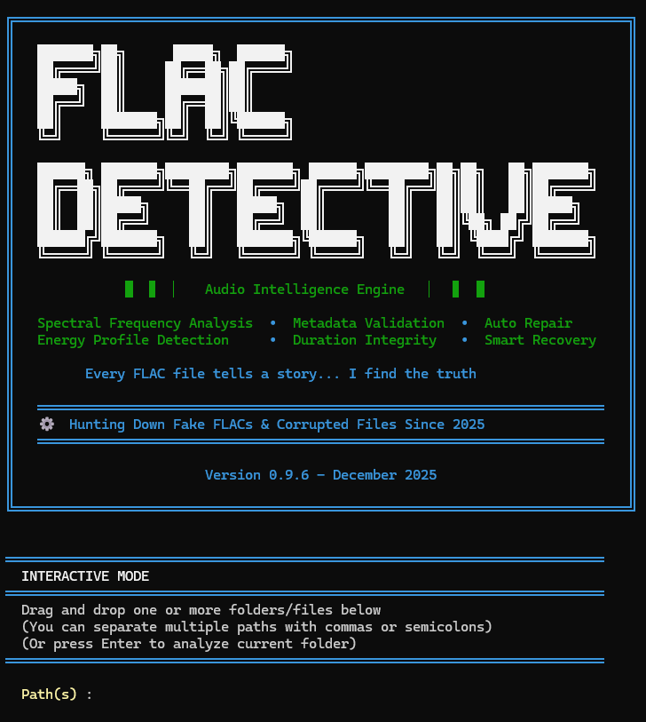

# 🎵 FLAC Detective


[](https://www.python.org/downloads/)
[](https://pypi.org/project/flac-detective/)
[](https://pypi.org/project/flac-detective/)
[](LICENSE)
[](https://github.com/Guillain-RDCDE/FLAC_Detective/actions/workflows/ci.yml)
[-brightgreen)](https://github.com/Guillain-RDCDE/FLAC_Detective/releases)
[](https://codecov.io/gh/Guillain-RDCDE/FLAC_Detective)
[](https://github.com/psf/black)
[](https://github.com/pre-commit/pre-commit)
[](https://guillain-rdcde.github.io/FLAC_Detective/)

**Advanced FLAC Authenticity Analyzer for Detecting MP3-to-FLAC Transcodes**

FLAC Detective is a professional-grade command-line tool that analyzes FLAC audio files to detect MP3-to-FLAC transcodes with high precision. Using spectral analysis, an 11-rule scoring system and an optional CNN classifier, it helps you keep your lossless music collection genuinely lossless.

---

## 🚀 Just want to check your music?

Someone can take an **MP3, re-save it as FLAC, and it *looks* lossless** — but the quality
was already thrown away. FLAC Detective finds those fakes.

```bash
pip install flac-detective       # install (needs Python 3.10+)
flac-detective /path/to/music    # scan a file or a whole folder
```

It reads each file and gives a verdict, like a traffic light:

```
✅ AUTHENTIC      real lossless         -> keep it
❓ WARNING        borderline            -> give it a listen
⚠️  SUSPICIOUS     probably a transcode  -> likely a fake
❌ FAKE_CERTAIN   definitely a fake     -> replace it
```

**Your files are safe** — the scan only *reads* them, it never changes anything.

👉 **New to all this? → [Start Here: the 5-minute beginner's guide](docs/start-here.md)**

---

## 🔍 How it works

Transcode an MP3 back to FLAC and the file is lossless *as a container* — but the
audio already went through a lossy codec, and that leaves fingerprints. The clearest
is a **spectral cliff**: MP3 discards everything above a bitrate-dependent frequency
(~16 kHz at 128 kbps, ~20 kHz at 320), so the spectrum falls off a wall where a real
recording keeps going.

FLAC Detective scores each file with **11 heuristic rules** built around that idea —
cutoff frequency vs. sample rate, MP3-bitrate signatures, compression artefacts
(pre-echo, aliasing), bitrate sanity — plus *protection* rules so genuine vinyl rips,
cassette transfers and naturally quiet recordings aren't flagged. An **optional 12th
rule** is a small CNN (`pip install "flac-detective[ml]"`) that *sharpens borderline
verdicts* — measured, it raises confidence on already-suspect files far more than it
catches fakes the heuristics miss outright. (Run with **`--deep`** and it does more: on a
full-range file the heuristics left silent, a confident CNN detection is surfaced as
**WARNING** — this is how high-bitrate AAC/Opus/Vorbis transcodes get caught.) The rules
sum to a 0–150 score and a 4-level verdict:

| Verdict | Score | What to do |
|---|---|---|
| ✅ **AUTHENTIC** | ≤ 30 | keep it |
| ❓ **WARNING** | 31–54 | borderline — check manually |
| ⚠️ **SUSPICIOUS** | 55–85 | likely a transcode |
| ❌ **FAKE_CERTAIN** | ≥ 86 | multiple indicators — definitely transcoded |

Higher score = stronger evidence of transcoding. The 0–150 range comes from summing the
rules (some add points for fake signatures, *protection* rules subtract them); the four
bands above turn that raw number into an action. The same thresholds drive the console,
the reports and the API — there's no second opinion hiding anywhere.

The guiding principle throughout is **"protect authentic files first"**: a false alarm
on real music is worse than missing a borderline fake.

→ Every rule explained: [Technical Details](docs/technical-details.md).

## 🤖 The ML side is a case study worth reading

Rule 12's model went through a real R&D saga, written up as a **learning resource**:
a false-positive audit over 11 234 real FLACs, four dead-ends that *didn't* work (each
instructive), a debunked "AUC 0.99" false discovery caught by cross-validation, and a
twist where a "fundamental limit" turned out to be an artifact of listening in **mono** —
fixed by going **stereo**.

📖 **[Read the ML detective story →](ml/README.md)** — worth a look even if you never
enable the ML extra.

## 🆕 Latest releases

- **v1.3.0 — visual HTML report.** `--format html` writes a single self-contained page
  (no external assets, no extra dependency) with a sortable/filterable triage table **and an
  inline spectrum plot for every flagged file** — the MP3 "cliff" is visible to the eye, with
  the detected cutoff marked. Computed with numpy and drawn as inline SVG; the core analysis
  path is untouched (spectra are recomputed at report time, for flagged files only).
- **v1.2.0 — `--deep` mode + high-confidence WARNING floor.** The CNN (Rule 12) actually
  *does* separate high-bitrate **AAC / Opus / Vorbis** transcodes from genuine FLAC on
  full-range audio (ROC-AUC 0.94–0.99) — but the fast path used to skip Rule 12 on the very
  files those fakes hide in. `--deep` runs the CNN on every file and surfaces a confident
  detection as **WARNING** (default scans stay fast). The old "AAC/Opus/Vorbis are
  near-undetectable" claim is now corrected: the real fundamental limit is *band-limited*
  material (baroque, 1920s, solo acoustic), not these codecs at high bitrate.
- **v1.1.0 — CSV library-triage report.** `--format csv` writes one row per file, **ranked
  most-suspicious-first** — triage a whole collection in a spreadsheet, riskiest first.
- **v1.0 — stable public API** ([SemVer](https://semver.org)): the CLI and its flags, the
  top-level exports (`FLACAnalyzer`, `ProgressTracker`, `find_flac_files`, `LOGO`,
  `__version__`) and the `analyze_file()` result-dict keys. Internals under `analysis/`
  may still change between minor versions.
- **Multi-format**: analyses **FLAC, WAV, ALAC (`.m4a`) and APE (`.ape`)** — detection is
  codec-agnostic (same spectral pipeline), and a lossy AAC `.m4a` is still correctly
  rejected (the real codec is probed, never trusted by extension).

The Rule 12 classifier reads the stereo **mid + side** channels instead of mono (v0.14),
fixing its weak spot on band-limited music (baroque, jazz, old recordings). *(Mid/side is
a way to encode stereo as **mid** = L+R average and **side** = L−R difference; MP3
quantises the side channel aggressively, so its fingerprints survive even when the
high-frequency cliff is faint.)* Real-world specificity on a library of 11 234 authentic
FLACs climbed from **80 % to 95 %**:

| | v0.12 (mono) | **v0.14 (stereo + gate)** |
|---|---|---|
| Specificity (authentic kept) | 80 % | **95 %** |
| Transcode recall | 87 % | **94 %** |

Full version-by-version history → **[CHANGELOG](CHANGELOG.md)**.

---

## ✨ Key Features

- **🎯 High Precision Detection**: 11-rule scoring system with intelligent protection mechanisms
- **📊 4-Level Verdict System**: Clear confidence ratings from AUTHENTIC to FAKE_CERTAIN
- **⚡ Performance Optimized**: 80% faster than baseline through smart caching and parallel processing
- **🔍 Advanced Analysis**: Spectral analysis, compression artifact detection, and multi-segment validation
- **🛡️ Protection Layers**: Prevents false positives for vinyl rips, cassette transfers, and high-quality MP3s
- **📝 Flexible Output**: Console reports with Rich formatting, JSON export, and detailed logging
- **🔧 Robust Error Handling**: Automatic retries, partial file reading, and comprehensive diagnostic tracking
- **🔨 Automatic Repair**: Undecodable FLAC files are losslessly rebuilt (reference `flac` tool, exact PCM, metadata preserved, `.bak` backup kept) so they can still be analysed — healthy files are never touched ([how & why](docs/technical-details.md#repair-lossless-reconstruction-only-when-needed))
- **🤖 CNN classifier (optional)**: A small ML model bundled with the package adds a 12th scoring rule on borderline cases. `pip install "flac-detective[ml]"` to enable.

---

## 🚀 Quick Start

### Installation

```bash
# Install via pip (Recommended)
pip install flac-detective

# OR with the optional CNN classifier (Rule 12)
pip install "flac-detective[ml]"

# OR run with Docker (multi-arch: linux/amd64 + linux/arm64)
docker pull ghcr.io/guillain-rdcde/flac_detective:latest
```

### Upgrading to the latest version

`pip install flac-detective` does **not** upgrade an existing install — if
you already have an older version, pip prints `Requirement already
satisfied` and exits without doing anything. To get the latest release,
add the `--upgrade` flag (short form `-U`):

```bash
# Upgrade to the latest version on PyPI
pip install --upgrade flac-detective

# Same thing with the optional ML extra
pip install --upgrade "flac-detective[ml]"

# Verify the new version
flac-detective --version

# Docker: pull again to refresh the image
docker pull ghcr.io/guillain-rdcde/flac_detective:latest
```

**📦 See [Getting Started](docs/getting-started.md) for complete installation instructions.**

### Basic Usage

```bash
# Analyze current directory
flac-detective .

# Analyze specific directory
flac-detective /path/to/music

# Interactive mode (prompts for paths, accepts drag-and-drop in Windows cmd)
flac-detective
```

### Common Options

```bash
# Show version and help
flac-detective --version
flac-detective --help

# Verbose log + JSON output to a custom path
flac-detective -v --format json --output report.json /music

# Triage a whole library: CSV ranked most-suspicious-first (opens in any spreadsheet)
flac-detective /music --format csv --output triage.csv

# Visual HTML report: a sortable triage table + a spectrum plot per flagged file
flac-detective /music --format html --output report.html

# Quick scan (15 s sample instead of default 30 s)
flac-detective --sample-duration 15 /music

# Deep scan: run the ML rule on every file to catch high-bitrate AAC/Vorbis
# transcodes the fast path would otherwise skip (slower — see the FAQ)
flac-detective --deep /music
```

> **Triaging a large collection?** `--format csv` writes one row per file, already
> **sorted by score (most suspicious at the top)** — sort/filter it in any spreadsheet
> to work through your library from the riskiest files down. The console summary also
> prints the top suspects so you see what to check first without opening anything.
>
> **Want to *see* why a file was flagged?** `--format html` writes a single self-contained
> page with a sortable triage table and an **inline spectrum plot for each flagged file** —
> the MP3 "cliff" (a sharp drop well below Nyquist) becomes visible at a glance, with the
> detected cutoff marked. No external assets, no extra dependency; just double-click to open.

**📖 See [User Guide](docs/user-guide.md) for detailed usage examples and command line options.**

### Try it Now (No Installation Required)

**Option 1: Docker with Sample File**
```bash
# Download a sample FLAC file (public domain)
curl -O https://archive.org/download/test_flac/sample.flac

# Run analysis with Docker (mount current directory)
docker run --rm -v "$(pwd)":/data ghcr.io/guillain-rdcde/flac_detective:latest /data/sample.flac
```

**Option 2: Quick Python Test**
```bash
# Using Python (if you have pip installed)
pip install flac-detective
flac-detective --version
flac-detective --help
```

**Option 3: Interactive Demo Script** ⭐ (Best for Quick Test)
```bash
# Clone and run demo with synthetic test files
git clone https://github.com/Guillain-RDCDE/FLAC_Detective.git
cd FLAC_Detective
pip install -e .
python examples/quick_test.py
```
This creates test files and shows FLAC Detective in action in 30 seconds!

**Option 4: GitHub Codespaces** (Fully Interactive Online)
1. Click the "Code" button → "Codespaces" → "Create codespace"
2. Wait for environment setup (~30 seconds)
3. Run: `pip install -e . && python examples/quick_test.py`

> **No sample files?** The tool works with **any FLAC file** from your music collection!

---

## 🎬 Demo

### Live Demo



Watch FLAC Detective analyze files with real-time progress bars and colored output!

### Example Output
```
======================================================================
  FLAC AUTHENTICITY ANALYZER
  Detection of MP3s transcoded to FLAC
======================================================================

⠋ Analyzing audio files... ━━━━━━━━━━━━━━━━━━━━━━━━━━━━━━━━━━━━━━━━  15% 0:02:34

======================================================================
  ANALYSIS COMPLETE
======================================================================
  FLAC files analyzed: 245
  Authentic files: 215 (87.8%)
  Fake/Suspicious files: 12 (4.9%)
  Text report: flac_report_20251220_143022.txt
======================================================================
```

---

## ⚡ Performance

FLAC Detective is optimized for both speed and accuracy:

- **Speed**: 2-5 seconds per file (30s sample, default)
- **Throughput**: 700-1,800 files/hour on modern hardware
- **Memory**: ~150-300 MB peak usage
- **Optimization**: 80% faster than baseline through intelligent caching and parallel processing
- **Scalability**: Handles libraries with 10,000+ files efficiently

**Customizable Performance**:
```bash
# Faster analysis (15s per file) - good for quick scans
flac-detective /music --sample-duration 15

# Balanced (30s per file) - default, recommended
flac-detective /music

# More thorough (60s per file) - maximum accuracy
flac-detective /music --sample-duration 60
```

---

## ❓ Frequently Asked Questions

### Does it work on Windows/Mac/Linux?

Yes! FLAC Detective is cross-platform and works on:
- ✅ Windows (7, 10, 11)
- ✅ macOS (10.14+)
- ✅ Linux (all major distributions)

### How accurate is the detection?

FLAC Detective uses an 11-rule scoring system with protection layers:
- **High confidence**: >95% accuracy for AUTHENTIC and FAKE_CERTAIN verdicts
- **Protection mechanisms**: Prevents false positives for vinyl rips, cassette transfers, and high-quality sources
- **4-level system**: AUTHENTIC, WARNING, SUSPICIOUS, FAKE_CERTAIN for nuanced results
- **Hard cases, and the `--deep` flag**: high-bitrate **AAC**, **Opus** and **Vorbis**
  transcodes leave no signal the *fast heuristic rules* can see — so on a default scan they
  read AUTHENTIC. But the optional ML rule (the CNN) *can* tell most of them apart from real
  FLAC on full-range audio. The catch: to keep big scans fast, the default skips the CNN on
  files the heuristics clear instantly — exactly where these fakes hide. Run **`--deep`** to
  force the CNN on every file; confident detections then surface as **WARNING** ("worth
  checking"). It's slower (a decode + CNN pass per file). The genuinely hard limit that
  `--deep` does *not* solve is **band-limited** material (baroque, 1920s, solo acoustic): a
  transcode there removes almost nothing, so authentic and fake look alike to any spectral
  tool. Treat AUTHENTIC as "no evidence of transcoding", not a guarantee — most for AAC and
  for band-limited sources.

### Will it damage or modify my files?

**Analysis is read-only.** It only reads your files, never rewrites them — safe to run
across your whole collection. There is exactly **one** exception, and it's hi-fi-safe by
design: if a FLAC is *so corrupted it can't be decoded at all* (even after retries), the
tool rebuilds a valid FLAC from it so the analysis can proceed. That rebuild is **lossless**
— it uses Xiph's reference `flac` tool to recover the exact PCM samples and re-encode them
bit-for-bit; **no resampling, normalisation or "enhancement" ever touches the audio.** It
**keeps a `.corrupted.bak` backup**, restores all tags/artwork, and **verifies** the result
before replacing anything. Healthy files are never rewritten.

→ Full, step-by-step explanation: [Repair — lossless reconstruction](docs/technical-details.md#repair-lossless-reconstruction-only-when-needed).
A standalone duration-fixer is also available: `python -m flac_detective.repair /path/to/files`.

### Can I trust the results?

Yes, with common sense. Each score band and what to do about it is in the verdict
table near the top of this README. For critical decisions, confirm with a
complementary tool (e.g. Spek for visual spectral analysis).

### What file formats are supported?

Currently:
- ✅ FLAC files (.flac) — read natively
- ✅ WAV files (.wav) — read natively, since v0.15.0
- ✅ ALAC (Apple Lossless, `.m4a`) and APE (Monkey's Audio, `.ape`) — since v0.16.0,
  decoded via **ffmpeg** (a hard dependency for these formats only; FLAC/WAV never
  need it). An `.m4a` holding lossy AAC is correctly rejected, not analysed.

### How long does analysis take?

About 2–5 s per file with the default 30 s sample — roughly 50–90 min for 1,000
files, a few hours for a 10,000-file library. The **Performance** section above
covers throughput and how `--sample-duration` trades speed for thoroughness.

### Can I use it in my own application?

Yes! FLAC Detective provides a Python API:

```python
from flac_detective import FLACAnalyzer

analyzer = FLACAnalyzer()
result = analyzer.analyze_file("song.flac")
print(result['verdict'])  # AUTHENTIC, WARNING, SUSPICIOUS, or FAKE_CERTAIN
```

See [examples/](examples/) directory for integration examples.

### Is it free and open source?

Yes! MIT License:
- ✅ Free for personal and commercial use
- ✅ Open source on GitHub
- ✅ Contributions welcome

### How can I contribute?

Bug reports, code, docs, and testing are all welcome — see
[CONTRIBUTING.md](.github/CONTRIBUTING.md).

---

## 📚 Documentation

📖 **Full documentation site: [guillain-rdcde.github.io/FLAC_Detective](https://guillain-rdcde.github.io/FLAC_Detective/)** (searchable, built from `docs/` on every release).

The same content lives in the `docs/` directory:

- [**Documentation Index**](docs/index.md) - Overview and navigation
- [**Getting Started**](docs/getting-started.md) - Installation and first analysis
- [**User Guide**](docs/user-guide.md) - Complete usage guide with examples
- [**Technical Details**](docs/technical-details.md) - Deep dive into detection rules and algorithms
- [**API Reference**](docs/api-reference.md) - Python API documentation
- [**Contributing**](.github/CONTRIBUTING.md) - Development guide

---

## 🎯 Use Cases

- **Library Maintenance**: Clean your music collection of fake lossless files
- **Quality Verification**: Validate FLAC authenticity before archiving
- **Batch Processing**: Analyze large music libraries efficiently
- **Format Validation**: Ensure genuine lossless quality for critical listening

### 💡 Quick Examples

See the [examples/](examples/) directory for ready-to-run scripts:
- **[basic_usage.py](examples/basic_usage.py)** - Simple file and directory analysis
- **[batch_processing.py](examples/batch_processing.py)** - Process multiple directories with statistics
- **[json_export.py](examples/json_export.py)** - Export results to JSON for further processing
- **[api_integration.py](examples/api_integration.py)** - Advanced API usage and integration patterns

---

## 🤝 Contributing

Contributions are welcome! Please read our [CONTRIBUTING.md](.github/CONTRIBUTING.md) for detailed guidelines and [CODE_OF_CONDUCT.md](.github/CODE_OF_CONDUCT.md) for community standards.

---

## 🔒 Security

For security policy and vulnerability reporting, please see [SECURITY.md](.github/SECURITY.md).

---

## 📝 License

This project is licensed under the MIT License - see the [LICENSE](LICENSE) file for details.

---

## 📞 Support

- **Issues**: [GitHub Issues](https://github.com/Guillain-RDCDE/FLAC_Detective/issues)
- **Discussions**: [GitHub Discussions](https://github.com/Guillain-RDCDE/FLAC_Detective/discussions)
- **Security**: see [SECURITY.md](.github/SECURITY.md)

---

## 🙏 Acknowledgements

Thanks to the community members who took the time to report bugs and confirm fixes — first issues are special.

- **[@GearKite](https://github.com/GearKite)** — Filed [#7](https://github.com/Guillain-RDCDE/FLAC_Detective/issues/7) with a clean traceback that pinpointed the circular import in v0.9.6, and [#6](https://github.com/Guillain-RDCDE/FLAC_Detective/issues/6) spotting the underscore-vs-dash Docker image name.
- **[@Aakiles](https://github.com/Aakiles)** — Diagnosed the circular import end-to-end and shipped a working patch via comment. The v0.9.7 fix is a refinement of his approach.
- **[@AnotherMuggle](https://github.com/AnotherMuggle)** and **[@tomelephant-git](https://github.com/tomelephant-git)** — Confirmed the fix across operating systems, including Windows 11 LTSC.
- **[@AKHwyJunkie](https://github.com/AKHwyJunkie)** — Confirmed the v0.9.6 import crash, validating @GearKite's report.
- **[@pblue3](https://github.com/pblue3)** — First reported the Docker image inaccessibility ([#6](https://github.com/Guillain-RDCDE/FLAC_Detective/issues/6)).

---

## ⭐ Star History

[](https://star-history.com/#Guillain-RDCDE/FLAC_Detective&Date)

---

**FLAC Detective** - *Maintaining authentic lossless audio collections*
