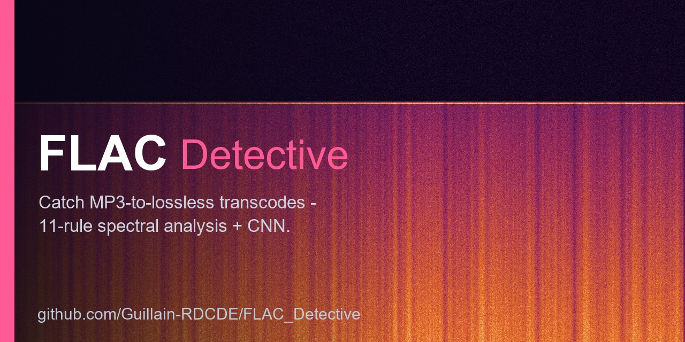

<p align="center">
  
</p>

# 🎵 FLAC Detective

> **An MP3 renamed to .flac looks lossless, weighs lossless, and fools every player you own. It can't fool a spectrogram — and this reads it for you.**

[](https://pypi.org/project/flac-detective/)
[](https://pypi.org/project/flac-detective/)
[](https://github.com/Guillain-RDCDE/FLAC_Detective/actions/workflows/ci.yml)
[](https://guillain-rdcde.github.io/FLAC_Detective/)
[](LICENSE)

**Find the fake FLACs in your music library.**

A lossy codec throws away the top of the spectrum and never gives it back. FLAC Detective reads
each file, spots the fingerprints that loss leaves behind, and tells you which files are real and
which are fakes.

```bash
pip install flac-detective       # needs Python 3.10+
flac-detective /path/to/music    # scan a file or a whole folder
```

Every file gets a verdict, like a traffic light:

```
✅ AUTHENTIC      real lossless         → keep it
❓ WARNING        borderline            → give it a listen
⚠️  SUSPICIOUS     probably a transcode  → likely a fake
❌ FAKE_CERTAIN   definitely a fake     → replace it
```

The scan only **reads** your files — it never changes anything.

> 🟢 **New to all this?** → **[Start Here — the 5-minute beginner's guide](docs/start-here.md)**
> No command line, no jargon. From *"what is this?"* to *"I checked my music"*.

---

## 📊 See why a file was flagged

Add `--format html` and you get a single self-contained page: a triage table sorted
worst-first, plus a spectrum plot for every flagged file. The MP3 **"cliff"** — a sharp drop
well below the real ceiling — is right there for the eye, with the detected cutoff marked.


*Three transcodes at different MP3 bitrates show the wall falling at different frequencies
(96 kbps ~11 kHz, 128 kbps ~16 kHz, 160 kbps ~17.5 kHz); the authentic file runs full-range.*

---

## 🔍 How it works

An MP3 re-saved as FLAC is lossless *as a container*, but the audio already passed through a
lossy codec — and that leaves fingerprints. The clearest is the **spectral cliff**: MP3
discards everything above a bitrate-dependent frequency, so the spectrum falls off a wall
where a real recording keeps going.

FLAC Detective scores each file with **11 heuristic rules** built around that idea (cutoff
frequency, MP3-bitrate signatures, compression artefacts) plus *protection* rules so genuine
vinyl rips, cassette transfers and naturally quiet recordings aren't flagged. An optional
**12th rule** — a small CNN — sharpens borderline verdicts. The rules sum to a 0–150 score:

| Verdict | Score | What to do |
|---|---|---|
| ✅ **AUTHENTIC** | ≤ 30 | keep it |
| ❓ **WARNING** | 31–54 | borderline — check manually |
| ⚠️ **SUSPICIOUS** | 55–85 | likely a transcode |
| ❌ **FAKE_CERTAIN** | ≥ 86 | definitely transcoded |

The guiding principle is **"protect authentic files first"**: a false alarm on real music is
worse than missing a borderline fake. Treat AUTHENTIC as *"no evidence of transcoding"*, not a
guarantee.

→ Every rule explained: **[Technical Details](docs/technical-details.md)**.

---

## ⚙️ Usage

```bash
flac-detective /path/to/music              # scan a folder
flac-detective                             # interactive (prompts for a path)

flac-detective /music --format csv  -o triage.csv   # spreadsheet, worst-first
flac-detective /music --format html -o report.html  # visual report (see above)
flac-detective /music --deep                        # catch high-bitrate AAC/Opus/Vorbis (slower)
flac-detective /music --advanced                    # show the plumbing: scores, cutoff, per-rule detail
```

By default the output is **easy mode** — a plain-language verdict and a recommended action
per file (*"Almost certainly a fake — the sound stops dead at ~16 kHz, the wall of a
128 kbps MP3. → Replace it."*). Add `--advanced` for the scores, cutoff frequencies and
per-rule reasoning. The desktop GUI has the same **Advanced** toggle.

Analyses **FLAC, WAV, ALAC (`.m4a`) and APE (`.ape`)** — codec-agnostic, and a lossy `.m4a`
is correctly rejected (the real codec is probed, never trusted by extension).

→ Full guide & every flag: **[User Guide](docs/user-guide.md)**.

### 🖥️ Prefer a window to a command line?

```bash
pip install "flac-detective[gui]"
flac-detective-gui
```

A desktop app (PySide6): choose a folder or drag it in, watch the progress bar, then
triage a sortable, colour-coded verdict table — click any file to see its spectrum with
the detected cutoff marked and the reasons for its verdict. Export to HTML/CSV/JSON.

### 🎚️ It also catches **fake hi-res**

Beyond lossy-as-lossless, FLAC Detective flags files *sold* as high-resolution that
aren't: 44.1/48 kHz **upsampled** to 96/192 kHz (a hard spectral cliff with digital
silence above it), and 16-bit audio **padded** into a 24-bit container. This is a
separate axis from the transcode verdict — reported as `hires_verdict`
(`GENUINE_HIRES` / `UPSAMPLED` / `PADDED_DEPTH` / …) in the CSV report, the GUI and the
Python API. A genuine 96 kHz recording that simply rolls off early reads `GENUINE_HIRES`,
not a false alarm.

<details>
<summary><b>Install options &amp; upgrading</b></summary>

```bash
pip install flac-detective                 # base
pip install "flac-detective[ml]"           # + optional CNN (Rule 12)
pip install "flac-detective[gui]"          # + desktop GUI (flac-detective-gui)
docker pull ghcr.io/guillain-rdcde/flac_detective:latest   # or Docker (amd64 + arm64)
```

`pip install` does **not** upgrade an existing install — use `-U` to get the latest release:

```bash
pip install -U flac-detective
flac-detective --version
```

</details>

<details>
<summary><b>Use it from Python or beets</b></summary>

**Python API:**

```python
from flac_detective import FLACAnalyzer

result = FLACAnalyzer().analyze_file("song.flac")
print(result["verdict"])   # AUTHENTIC, WARNING, SUSPICIOUS, or FAKE_CERTAIN
```

**[beets](https://beets.io) plugin** — triage transcodes without leaving your workflow:

```bash
pip install "flac-detective[beets]"
# in config.yaml:  plugins: flacdetective

beet flacdetective                          # analyse & tag the whole library
beet ls flacdetective_verdict:FAKE_CERTAIN  # list the certain fakes
```

Stores `flacdetective_verdict` and `flacdetective_score` on each item; an optional
`auto: yes` analyses files **as they're imported**.

</details>

---

## 🤖 The ML side: a case study worth reading

Rule 12's model went through a real R&D saga, written up as a **learning resource**: a
false-positive audit over 11 234 real FLACs, four instructive dead-ends, a debunked
"AUC 0.99" caught by cross-validation, and a twist where a "fundamental limit" turned out to
be an artifact of listening in **mono** — fixed by going **stereo**. Real-world specificity
on 11 234 authentic FLACs climbed from **80 % to 95 %**.

📖 **[Read the ML detective story →](ml/README.md)**

---

## 📚 More

- 📖 **[Full documentation site](https://guillain-rdcde.github.io/FLAC_Detective/)** — getting started, user guide, technical details, API
- 🚀 **[Getting Started](docs/getting-started.md)** — install, first analysis, accuracy & file-safety notes
- 📋 **[Changelog](CHANGELOG.md)** · 🤝 **[Contributing](.github/CONTRIBUTING.md)** · 🔒 **[Security](.github/SECURITY.md)**
- 💬 **[Issues](https://github.com/Guillain-RDCDE/FLAC_Detective/issues)** · **[Discussions](https://github.com/Guillain-RDCDE/FLAC_Detective/discussions)**

---

Licensed under the **[MIT License](LICENSE)**.

</content>
</invoke>
